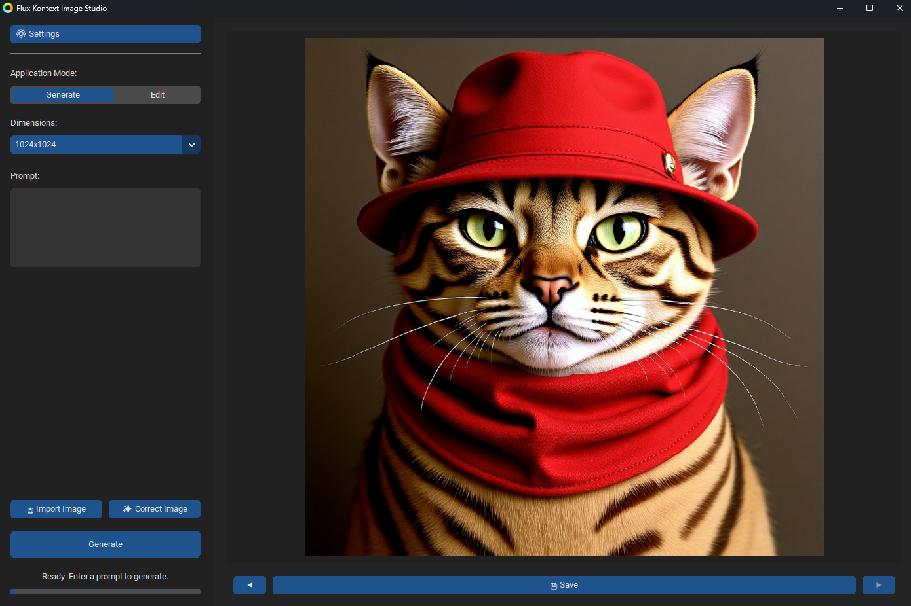

<div align="left">
  <a href="../README.md" target="_blank"></a>
</div>

# FastAPP-Flux-Kontext

Schnelle Bilderzeugung und -bearbeitung in einer einzigen Anwendung.

<p align="center">
  
</p>

## Voraussetzungen

**System & Hardware**
- Windows 10/11
- NVIDIA GPU, kompatibel mit CUDA 12.6
- 16 GB RAM (Minimum)
- 4 GB VRAM (Minimum)
- *Hinweis: Dieser Code wurde auf einem System mit 64 GB RAM und 12 GB VRAM getestet.*

---

## Automatische Installation

Wählen Sie die Installationsmethode, die Ihnen am besten passt.

### Methode 1: Über die Installations-Executable

Dies ist die direkteste Methode und simuliert die Installation einer Standard-Windows-Anwendung. Sie ist perfekt, wenn Sie eine einzelne Datei zum Herunterladen und Ausführen bevorzugen, ohne mit Code zu hantieren.

#### 1. Herunterladen
Laden Sie die neueste ausführbare Datei aus dem [GitHub Releases](https://github.com/Juste-Leo2/FastAPP-Flux-Kontext/releases)-Bereich herunter.

#### 2. Starten
Windows Defender SmartScreen könnte die Ausführung der Anwendung verhindern, da sie als unbekannte Software identifiziert wird.
<br>

<br>
Um fortzufahren, klicken Sie auf **Weitere Informationen** und dann auf **Trotzdem ausführen**.

#### 3. Installationspfad
Bevorzugen Sie Standard-Installationsorte (z. B. Ihren Desktop oder den Dokumente-Ordner). Vermeiden Sie geschützte Systemordner wie `C:\Program Files`, die zu Berechtigungsproblemen führen könnten.

---

### Methode 2: Über die Skripte aus dem Repository (Transparenz und Kontrolle)

Diese Methode bietet Ihnen volle Kontrolle und vollständige Transparenz. Sie wird empfohlen, wenn Sie vorkompilierte ausführbare Dateien vermeiden oder den Code vor der Ausführung überprüfen möchten. Obwohl das Abrufen des Codes ein erster Schritt ist, **bleibt die Installation dank der bereitgestellten Skripte vollständig automatisch**.

Sie können den Code der Skripte vor der Ausführung überprüfen, um deren Inhalt zu verifizieren:
- Die Installationslogik ist in `setup.bat`, `src/setup.ps1` und `src/install_steps.bat` sichtbar.
- Das Startskript der Anwendung ist `run.bat` und `src/run.ps1`.

#### 1. Quellcode beziehen
Sie haben zwei Möglichkeiten:

*   **Option A (mit Git):** Öffnen Sie ein Terminal und klonen Sie das Repository.
    ```bash
    git clone https://github.com/Juste-Leo2/FastAPP-Flux-Kontext.git
    cd FastAPP-Flux-Kontext
    ```
*   **Option B (ohne Git):** Klicken Sie auf den grünen Button `<> Code` oben auf der Repository-Seite und dann auf `Download ZIP`. Entpacken Sie das Archiv in einen Ordner Ihrer Wahl.

#### 2. Automatische Installation starten (`setup.bat`)
Sobald Sie sich im Projektordner befinden, doppelklicken Sie auf die Datei `setup.bat`. Dieses Skript installiert automatisch alle erforderlichen Komponenten.

**Warnung:** Windows Defender SmartScreen kann auch dieses Skript blockieren. Wie bei der ausführbaren Datei, klicken Sie auf **Weitere Informationen** und dann auf **Trotzdem ausführen**, um es zu erlauben.

#### 3. Anwendung starten (`run.bat`)
Nach der Installation doppelklicken Sie auf `run.bat`, um die Anwendung zu starten. Sie können eine Verknüpfung zu dieser Datei auf Ihrem Desktop erstellen, um den Zugriff zu erleichtern.


---

## Manuelle Installation

**Erforderliche Software**
- [Anaconda](https://www.anaconda.com/products/individual)

### 1. Repository klonen

Klonen Sie zunächst das GitHub-Repository in ein Verzeichnis Ihrer Wahl.

```bash
git clone https://github.com/Juste-Leo2/FastAPP-Flux-Kontext.git
cd FastAPP-Flux-Kontext
```

### 2. Conda-Umgebung erstellen und aktivieren

Erstellen Sie eine spezifische Conda-Umgebung für dieses Projekt und aktivieren Sie sie.

```bash
conda create -n flux_env python=3.12.1 ca-certificates certifi openssl -y
conda activate flux_env
```

### 3. CUDA installieren

Installieren Sie die kompatible CUDA-Version über Conda.

```bash
conda install -c nvidia/label/cuda-12.6.0 cuda -y
```

### 4. uv installieren

Installieren Sie `uv`, einen schnelleren Paketmanager für Python.

```bash
pip install uv
```

### 5. Python-Abhängigkeiten installieren

Installieren Sie alle Projektabhängigkeiten, die in der Datei `requirements.txt` aufgeführt sind.

```bash
uv pip install -r requirements.txt
```

### 6. PyTorch mit CUDA-Unterstützung installieren

Installieren Sie die passende PyTorch-Version für die GPU-Unterstützung.

```bash
uv pip install torch torchvision torchaudio --extra-index-url https://download.pytorch.org/whl/cu126 --reinstall
```

### 7. GPU-Erkennung durch PyTorch überprüfen

Führen Sie den folgenden Befehl aus, um sicherzustellen, dass Ihre GPU korrekt erkannt wird.

```bash
python -c "import torch; assert torch.cuda.is_available(), 'PyTorch hat CUDA nicht erkannt!'"
```

### 8. Modelle herunterladen

Laden Sie die erforderlichen Modelle über die direkten Links unten herunter und legen Sie sie im Ordner `models/` ab.

- [Diffuser (FLUX.1) herunterladen](https://huggingface.co/mit-han-lab/nunchaku-flux.1-kontext-dev/resolve/main/svdq-int4_r32-flux.1-kontext-dev.safetensors)
- [Autoencoder (AE) herunterladen](https://huggingface.co/Comfy-Org/Lumina_Image_2.0_Repackaged/resolve/main/split_files/vae/ae.safetensors)
- [T5 Encoder herunterladen](https://huggingface.co/comfyanonymous/flux_text_encoders/resolve/main/t5xxl_fp8_e4m3fn_scaled.safetensors)
- [CLIP-L Encoder herunterladen](https://huggingface.co/comfyanonymous/flux_text_encoders/resolve/main/clip_l.safetensors)
- [LoRA (Turbo) herunterladen](https://huggingface.co/alimama-creative/FLUX.1-Turbo-Alpha/resolve/main/diffusion_pytorch_model.safetensors)

Die Struktur Ihres `models/`-Ordners sollte wie folgt aussehen:

```
FastAPP-Flux-Kontext/
└── models/
    ├── svdq-int4_r32-flux.1-kontext-dev.safetensors
    ├── ae.safetensors
    ├── t5xxl_fp8_e4m3fn_scaled.safetensors
    ├── clip_l.safetensors
    └── diffusion_pytorch_model.safetensors
```

### 9. Anwendung starten

Sobald die Einrichtung abgeschlossen ist, starten Sie die Anwendung mit dem folgenden Befehl:

```bash
python src/main.py
```

---

## Danksagungen

- **[ComfyUI](https://github.com/comfyanonymous/ComfyUI)**: für dieses unglaubliche Projekt, das als Grundlage für einen großen Teil des Codes diente.
- **[black-forest-labs](https://huggingface.co/black-forest-labs)**: für das Teilen der ursprünglichen FLUX-Kontext-Gewichte.
- **[mit-han-lab](https://huggingface.co/mit-han-lab)**: für die Quantisierung von FLUX-Kontext, was ein besseres Verhältnis von Größe zu Leistung bietet.

---

## Lizenz

### Projektcode

Der Code dieses Projekts wird unter der GNU General Public License v3.0 (GPLv3) vertrieben. Es steht Ihnen frei, den Code gemäß den in der [LICENSE](../LICENSE)-Datei angegebenen Bedingungen zu verwenden, zu teilen und zu ändern.

### Modelle

**Wichtig:** Die vorab trainierten Modelle, die zur Ausführung dieser Anwendung erforderlich sind, unterliegen einer separaten Lizenz: der **[FLUX.1 [dev] Non-Commercial License](https://huggingface.co/black-forest-labs/FLUX.1-Kontext-dev/blob/main/LICENSE.md)**.

Durch das Herunterladen und Verwenden dieser Modelle stimmen Sie deren Bedingungen zu, die jegliche kommerzielle Nutzung strikt untersagen.