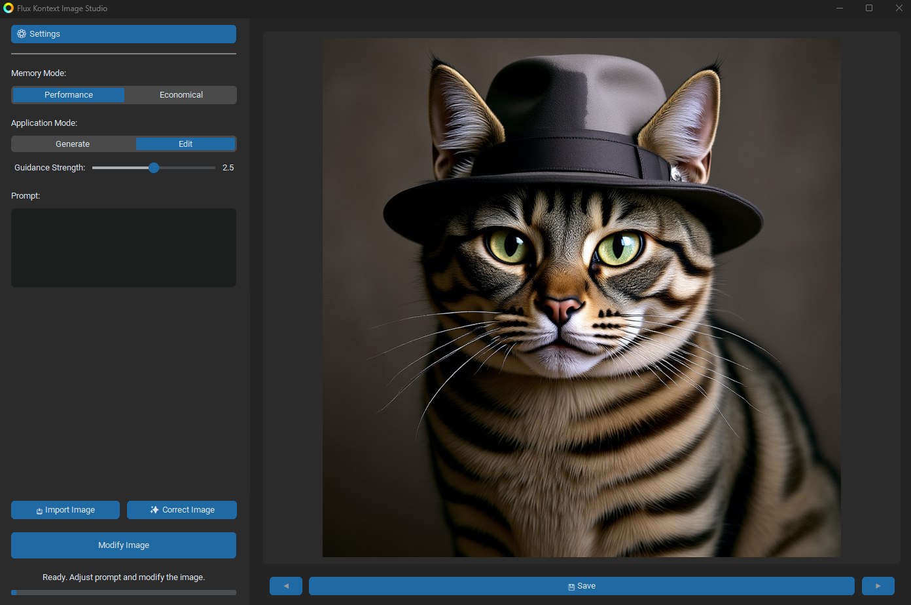

<div align="left">
  <a href="../README.md" target="_blank"></a>
</div>

# FastAPP-Flux-Kontext

Generación y edición rápida de imágenes en una sola aplicación.

<p align="center">
  
</p>

## Requisitos Previos

**Sistema y Hardware**
- Windows 10/11
- GPU NVIDIA compatible con CUDA 12.6
- 16 GB de RAM (mínimo)
- 4 GB de VRAM (mínimo)
- *Nota: Este código fue probado en una configuración con 64 GB de RAM y 12 GB de VRAM.*

---

## Instalación Automática

### 1. Descarga

Utilice el ejecutable disponible en los [lanzamientos de GitHub](https://github.com/Juste-Leo2/FastAPP-Flux-Kontext/releases).

### 2. Ejecución

Windows Defender SmartScreen puede impedir la ejecución de la aplicación, identificándola como software no reconocido.
<br>

<br>
Haga clic en **Más información** y luego en **Ejecutar de todas formas**.

### 3. Ruta de Instalación

Prefiera ubicaciones de instalación estándar (por ejemplo, su Escritorio o la carpeta Documentos). Evite las carpetas protegidas del sistema como `C:\Program Files`.

---

## Instalación Manual

**Software Requerido**
- [Anaconda](https://www.anaconda.com/products/individual)

### 1. Clonar el Repositorio

Comience clonando el repositorio de GitHub en un directorio de su elección.

```bash
git clone https://github.com/Juste-Leo2/FastAPP-Flux-Kontext.git
cd FastAPP-Flux-Kontext
```

### 2. Crear y Activar el Entorno de Conda

Cree un entorno de Conda específico para este proyecto y actívelo.

```bash
conda create -n flux_env python=3.12.1 ca-certificates certifi openssl -y
conda activate flux_env
```

### 3. Instalar CUDA

Instale la versión compatible de CUDA a través de Conda.

```bash
conda install -c nvidia/label/cuda-12.6.0 cuda -y
```

### 4. Instalar uv

Instale `uv`, un gestor de paquetes más rápido para Python.

```bash
pip install uv
```

### 5. Instalar Dependencias de Python

Instale todas las dependencias del proyecto listadas en el archivo `requirements.txt`.

```bash
uv pip install -r requirements.txt
```

### 6. Instalar PyTorch con Soporte para CUDA

Instale la versión apropiada de PyTorch para el soporte de GPU.

```bash
uv pip install torch torchvision torchaudio --extra-index-url https://download.pytorch.org/whl/cu126 --reinstall
```

### 7. Verificar la Detección de la GPU por PyTorch

Ejecute el siguiente comando para asegurarse de que su GPU se detecta correctamente.

```bash
python -c "import torch; assert torch.cuda.is_available(), '¡PyTorch no detectó CUDA!'"
```

### 8. Descargar los Modelos

Descargue los modelos requeridos desde los enlaces directos a continuación y colóquelos en la carpeta `models/`.

- [Descargar Diffuser (FLUX.1)](https://huggingface.co/mit-han-lab/nunchaku-flux.1-kontext-dev/resolve/main/svdq-int4_r32-flux.1-kontext-dev.safetensors)
- [Descargar Autoencoder (AE)](https://huggingface.co/Comfy-Org/Lumina_Image_2.0_Repackaged/resolve/main/split_files/vae/ae.safetensors)
- [Descargar T5 Encoder](https://huggingface.co/comfyanonymous/flux_text_encoders/resolve/main/t5xxl_fp8_e4m3fn_scaled.safetensors)
- [Descargar CLIP-L Encoder](https://huggingface.co/comfyanonymous/flux_text_encoders/resolve/main/clip_l.safetensors)
- [Descargar LoRA (Turbo)](https://huggingface.co/alimama-creative/FLUX.1-Turbo-Alpha/resolve/main/diffusion_pytorch_model.safetensors)

La estructura de su carpeta `models/` debería verse así:

```
FastAPP-Flux-Kontext/
└── models/
    ├── svdq-int4_r32-flux.1-kontext-dev.safetensors
    ├── ae.safetensors
    ├── t5xxl_fp8_e4m3fn_scaled.safetensors
    ├── clip_l.safetensors
    └── diffusion_pytorch_model.safetensors
```

### 9. Iniciar la Aplicación

Una vez completada la instalación, inicie la aplicación con el siguiente comando:

```bash
python src/main.py
```

---

## Agradecimientos

- **[ComfyUI](https://github.com/comfyanonymous/ComfyUI)**: por este increíble proyecto, que sirvió de base para gran parte del código.
- **[black-forest-labs](https://huggingface.co/black-forest-labs)**: por compartir los pesos originales de FLUX-Kontext.
- **[mit-han-lab](https://huggingface.co/mit-han-lab)**: por cuantificar FLUX-Kontext, ofreciendo una mejor relación tamaño/rendimiento.

---

---

## Licencia

### Código del Proyecto

El código de este proyecto se distribuye bajo la Licencia Pública General de GNU v3.0 (GPLv3). Usted es libre de usar, compartir y modificar el código bajo los términos especificados en el archivo [LICENSE](../LICENSE).

### Modelos

**Importante:** Los modelos pre-entrenados necesarios para ejecutar esta aplicación están sujetos a una licencia separada: la **[Licencia No Comercial FLUX.1 [dev]](https://huggingface.co/black-forest-labs/FLUX.1-Kontext-dev/blob/main/LICENSE.md)**.

Al descargar y utilizar estos modelos, usted acepta sus términos, que prohíben estrictamente cualquier uso comercial.